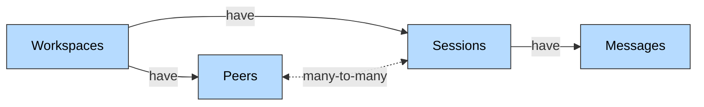
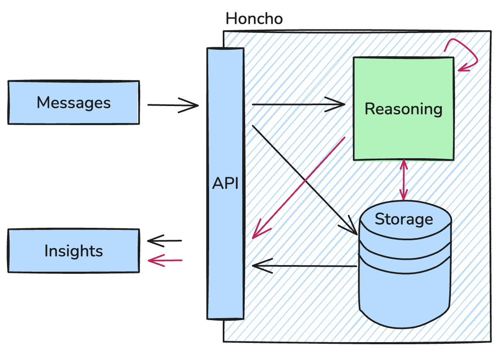

# Honcho Architecture

Honcho is memory infrastructure for LLM agents. It continuously analyzes conversational data and constructs detailed peer profiles over time. Messages are written through a REST API, processed asynchronously by background workers, and recalled through a natural-language query endpoint that returns grounded answers about any peer.

## Data Model

The platform centers on four primary entities in a hierarchical relationship:

- **Workspaces** are top-level containers providing complete isolation between applications or environments. They serve as namespaces for separate workloads and enable multi-tenant SaaS architectures where each customer maintains isolated data.
- **Peers** represent the core focus — any individual user, agent, or persistent entity. Everything in the system revolves around building and maintaining their representations. A peer can span multiple sessions while accumulating cross-session context.
- **Sessions** establish interaction threads or temporal boundaries between peers. They scope context to specific interactions while preserving longer-term peer understanding across sessions.
- **Messages** are the fundamental interaction units within sessions. Beyond typical communication, they can represent emails, documents, files, user actions, system notifications, or rich media content.

### Representation as a typed graph

The artifact the system actually produces and queries is a peer's **representation** — atomic conclusions about that peer derived from messages. Each conclusion carries an inference level and a link to its sources:

- `explicit` — directly stated in a message.
- `deductive` — logically necessary given a set of explicit conclusions.
- `inductive` — a pattern across multiple conclusions.
- `contradiction` — an inconsistency between conclusions.

Every conclusion's `source_ids` point at the conclusions or messages it was derived from. The representation is therefore a **provenance-tracked reasoning graph**, not a flat list of facts: any claim can be expanded back to its evidence. A bounded **peer card** — a curated biographical summary refined over time — sits on top as the durable identity layer.

The cost-shape rationale for splitting reasoning across these levels is in [case-study.md](case-study.md).

## Processing Architecture

Agents write messages to Honcho, which triggers reasoning that updates peer representations. Insights are read back through a query API.

Data flows through the system asynchronously: messages written via the API are persisted immediately and then trigger background reasoning tasks. Workers generate conclusions, summaries, and insights and store them alongside the messages. Query endpoints retrieve relevant conclusions plus recent messages to assemble grounded context for downstream agent prompts.

### The cognitive loop

The asynchronous workers form a cognitive loop operating at three latencies — fast extraction on every message, deeper consolidation on idle peers, query-time reasoning on each recall. The conceptual framing of these stages, and why they're split this way rather than collapsed into a single worker, is the subject of [case-study.md](case-study.md).

## Design Philosophy

The architecture emphasizes:

- **Peer-centric organization.** Humans and agents are both peers. Observation relationships are configurable per pair.
- **Reasoning-first memory.** Documents are not stored verbatim; they are atomic conclusions derived from messages, with provenance back to source.
- **Asynchronous processing.** Message ingestion never blocks on LLM work. Reasoning happens on read or on idle, not on write.
- **Provider-agnostic LLM support.** Anthropic, OpenAI, and Gemini are interchangeable behind a single surface.
- **Multi-tenant scalability.** Workspaces isolate data; workers coordinate through the shared database.
- **Unified treatment of users and agents as peers.** A query about what one peer knows of another, and a query about the omniscient view of a peer, are the same primitive with different `(observer, observed)` pairs.
